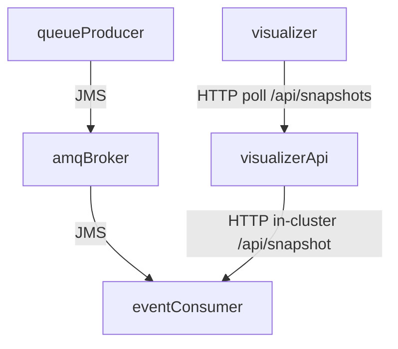

# Architecture

## Components

- **AMQ Broker 7.x**: messaging broker (Artemis) deployed on OpenShift via **AMQ Broker Operator**.
- **queue-producer**: sends JSON demo events to the broker.
- **event-consumer**: consumes from the broker, tracks received/duplicates, and exposes `GET /api/snapshot`.
- **visualizer**: minimal UI that polls one or more snapshot URLs and renders counters + last messages.
- **OpenShift GitOps (Argo CD)**: installs operators, broker instance, and the applications via GitOps.
- **OpenShift Logging**: used to browse stdout logs from producer/consumer/visualizer.
- **OpenShift Dev Spaces**: in-cluster development environment for the modern codebase.

## Data flow

